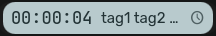
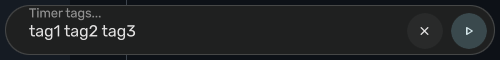
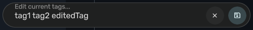

# qs-timew

Timewarrior integration module for QML applications.



## Requirements

- Qt 6.0+
- [timewarrior](https://timewarrior.net/) 1.4+

## Installation

```bash
git clone https://github.com/dustin-s/qs-timew.git
```

Add to your QML import path:

```bash
export QML2_IMPORT_PATH=$QML2_IMPORT_PATH:/path/to/qs-timew
```

## Usage

### Basic Widget

```qml
import QtQuick
import qs_timew 2.0

Rectangle {
    width: 180
    height: 32

    TimewarriorWidget {
        anchors.fill: parent
    }
}
```

Click to toggle timer. Right-click to edit tags.

### Direct Service Access

```qml
import qs_timew 2.0

// Start with tags
TimewarriorService.start(["work", "project"])

// Stop
TimewarriorService.stop()

// Toggle (reuses last tags)
TimewarriorService.toggle()

// Edit tags on running timer
TimewarriorService.updateTags(["work", "different-project"])
```

### Service Properties

```qml
TimewarriorService.active       // bool: timer running
TimewarriorService.tags         // array: current tags
TimewarriorService.elapsed      // string: "00:15:32"
TimewarriorService.status       // string: display text
```

## Widget States

| State | Display |
|-------|---------|
| Stopped |  |
| Running |  |
| Tag Input |  |
| Tag Edit |  |

## License

MIT
